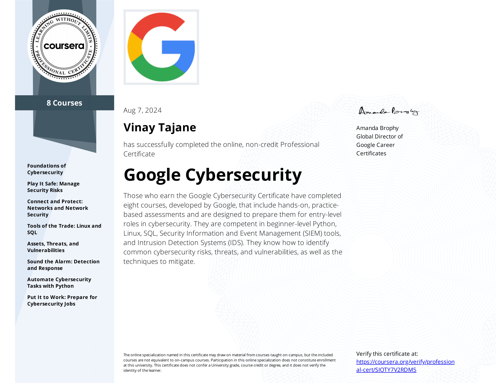

# Google Cybersecurity Professional Certificate Portfolio

Welcome to my portfolio for the Google Cybersecurity Professional Certificate. This repository showcases my work and progress throughout the certificate program, which is designed to equip learners with essential skills for a career in cybersecurity.

You can verify my accomplishment through my certificate on [Credly](https://www.credly.com/badges/125ca6ce-54dc-436e-b22b-672f76858341/public_url) or [Coursera](https://coursera.org/share/bd66b1d53a61fafc387168c25d9b63b8).

## Overview
The Google Cybersecurity Professional Certificate consists of 8 courses that cover critical topics in cybersecurity, including risk management, incident response, and the use of various tools and technologies. The program emphasizes hands-on experience and practical applications, preparing learners for entry-level roles in the field.

For more details visit [Google Cybersecurity Professional Certificate](https://www.coursera.org/professional-certificates/google-cybersecurity).

## Skills Acquired
Through this program, I have developed competencies in the following areas:
- **Python Programming**: Gained proficiency in writing scripts for automation and data analysis.
- **Linux**: Learned to navigate and manage Linux systems, a critical environment for many cybersecurity tools.
- **SQL**: Acquired skills in database management and querying for data retrieval and analysis.
- **Security Information and Event Management (SIEM)**: Gained experience in monitoring and analyzing security events.
- **Intrusion Detection Systems (IDS)**: Learned to identify and respond to potential security breaches.

## Portfolio Structure
This repository is organized by course name, with each course containing associated projects and assignments. Below is the structure:

**Course 1 - Foundations of Cybersecurity**
- My Professional Statement

**Course 2 - Play It Safe - Manage Security Risks**
- Conducting a Security Audit

**Course 3 - Connect and Protect - Networks and Network Security**
1. Analyze Network Layer Communication
2. Analyze Network Attacks
3. Apply OS Hardening Techniques
4. Analysis of Network Hardening
5. Use the NIST Cybersecurity Framework to respond to a security incident

**Course 4 - Tools of the Trade - Linux and SQL**
- Apply filters to SQL queries
- Use Linux commands to manage file permissions

**Course 5 - Assets, Threats, and Vulnerabilities**
- Identifying Vulnerabilities For a Small Business

**Course 6 - Sound the Alarm Detection and Response**
- Documenting Incidents With an Incident Handlers Journal

**Course 7 - Automate Cybersecurity Tasks with Python**
- Update a File Through a Python Algorithm

## License
This repository is shared under the MIT License, allowing for free access and reference. It is intended for personal documentation and learning purposes.

Thank you for visiting my portfolio. I look forward to connecting with others in the cybersecurity community and exploring potential career opportunities!
